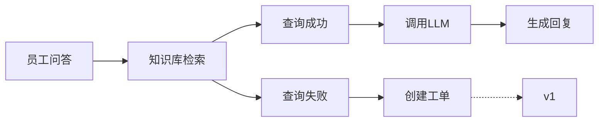
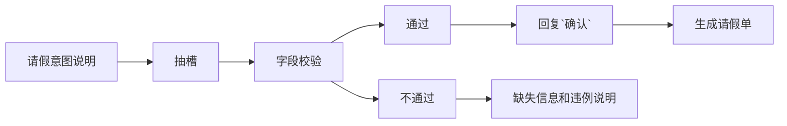
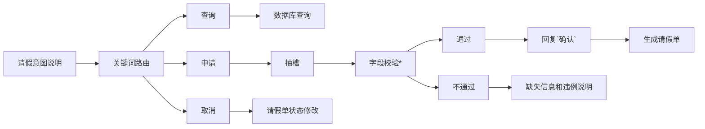

# kb_assistant
## 项目名称
企业制度/知识一体化的助理

## 项目描述
### 🅰️ 整体描述
为了解决员工查找资料困难的问题，提高工作的效率，我们开发了一个 [企业制度/知识一体化的助理] 的项目
本项目基于 LangGraph、RAG、Chroma 等技术构建

其目标是：
    让企业员工可以通过问答的形式来查询企业的知识库（例如公司的产品文档），还可以查询请假/报销等一系列流程，
另外，如果你所问到的问题不在此知识库中，你还可以提交工单供管理员审核。

#### 1. 基础版本
此版本实现了智能问答的核心流程，流程如下：


#### 2. v1 版本
此版本在基础版本的基础上，为了完成系统中的工单，<span style="color: blue">添加了构建/重构知识库的功能</span>，以更好地解决企业知识库中没有相关知识的问题

#### 3. v2/v3 版本
此版本实现了员工的请假申请，v2版本实现了基本的请假流程，v3细化了请假的流程，并使用MySQL存储请假单，redis存SessionID等等

#### 4. v4 版本（待开发）
可能会增加权限管理


### 🅱️ 详细描述
#### 1. 基础版本
员工在前端页面询问问题，后端拿到具体问题之后，使用 RAG 在 chromadb 中检索数据（企业的知识库已提前使用 zhipuai 的 embedding-3 模型嵌入到了 chromadb 中）
- 如果检索到相关数据，则将这些数据作为 【具体问题】 的上下文，之后将其传入到 【提示词（多角色）】 中来调用远程的 LLM（deepseek） 生成相关回复
- 如果没有检索到相关数据，则系统将提示你需要创建工单

#### 2. v1 版本
员工前端提交工单且相关审核人员审核通过后，管理者会在此系统上构建/重建知识库。
- 构建知识库

    管理者会在前端页面中提交上传文件的表单，后端收到表单数据之后调用 fastapi + langchain等，将文件处理为Document对象，随后将其嵌入到 chroma 的某个 collection 中

- 重建知识库

    管理者会在前端页面中点击重建知识库的按钮，后端收到此请求之后，先清空 chroma 中原有的 collection，之后再将默认目录下的知识库处理为 Document 对象，并将其嵌入到 chroma 中

#### 3. v2/v3 版本
v2/v3 都实现了请假的流程

##### 🅰️ v2的流程如下：

此版本新增并完善了以下几点：
1. **抽槽**： 槽位抽取是对用户意图理解的进一步细化，可以简单理解为提取关键字（例如员工请假的时间，类型等等）
2. **字段校验**： 抽取的槽位需要**符合请假的必要信息**和**遵守公司的规章制度**，若校验不成功，生成缺失字段的说明和违例说明

执行 v2 出现的bug如下

用户询问：
```text
我下周二想请一天年假
```
系统回复：
```text
缺少信息：start_time、end_time。请补充/修正后再说一次              
```
可以看到，并不能很好的识别下周二、一天假期等**时间**信息，之后用户输入
```text
我要请年假，2025-12-26 09:00 到 2025-12-26 18:00
```
系统就会回复：
```text
请确认你的请假信息：
    - 类型：annual
    - 开始：2025-12-26 09:00
    - 结束：2025-12-26 18:00
    - 时长：1.12 天
    - 原因：无
    回复“确认”提交，或直接回复修改后的信息。
```

**但是**，我们**更希望**当给到大模型 "我下周二想请一天年假" 这句话的时候，就应该回复 "请确认你的请假信息..."，另外，请假单并没有真正的存在数据库中

为了解决上述的种种问题，我们开发了 v3 版本


##### 🅱️ v3的流程如下：

此版本新增并完善了以下几点：
1. **MySQL 数据库**：请假单的信息存储到了 MySQL 数据库中，对应的类为 /app/workflows/models.py 中的LeaveRequest，这被称为ORM
2. **Redis 缓存**： 将用户的 `session_id` 存储到了 Redis 中
3. **日期解析**： 使用合适的 prompts 让大模型进行日期解析，对应的提示词在 /app/prompts/parse_date_prompt.py 中
4. **关键词路由**： 根据用户说的话中是否包含某些特定词语，来把它们路由分发到对应的处理流程
5. **字段校验**： 此功能在 v2 版本的基础上增加了假期余额的校验等功能


此版本的运行效果如下：

用户询问：
```text
我下周二想请一天年假
```
系统回复：
```text
请确认你的请假信息：
    - 类型：annual
    - 开始：2025-12-26 09:00
    - 结束：2025-12-26 18:00
    - 时长：1.12 天
    - 原因：无
    回复“确认”提交，或直接回复修改后的信息。
```
用户询问：
```text
确认
```
系统回复：
```text
已为你提交请假申请，编号 LV-4936e589，等待审批。
```


#### 4. v4版本（待开发）
...

## 项目架构
```text
kb_assistant/
|—— app/                                    源代码
|   |—— db_ops/                             数据库操作
|       |—— leave_sql.py
|   |—— ingestion/
|       |—— build_index.py                      构建索引
|       |—— loader.py                       
|   |—— prompts/                            各类提示词
|   |—— rag/                                知识检索
|       |—— vectorstore.py
|       |—— qa_graph.py                         QA 图
|   |—— workflows/
|       |—— leave/
|           |—— leave_graph.py
|           |—— models.py
|           |—— rules.py
|   |—— config.py                           配置     
|   |—— deps.py
|   |—— router_graph.py                     顶级路由
|   |—— main.py                             主函数入口
|—— data/                                   数据
|   |——  docs/                                  语料库
|       |—— 公司考勤管理制度.docx
|       |—— 请假审批流程说明.docx
|       |—— 公司薪酬管理制度.pdf
|   |—— tests/                              测试代码
|       |—— test_loader.py
|       |—— test_rules.py
|   |—— ui/                                 前端界面
|       |—— streamlit_app.py

|—— index.html                            主页
|—— reindex.html                          重建索引的主页
|—— requirements.txt                      项目所需安装包
```

## 其他

例如，修改requirements.txt，添加
python-multipart==0.0.20
aiofiles==24.1.0
streamlit==1.40.2

使用如下命令更新
```bash
pip install -U -r requirements.txt
```

## 待优化部分
1. 日期处理不完善
2. 请假单的数据库设计不完善
3. ...


