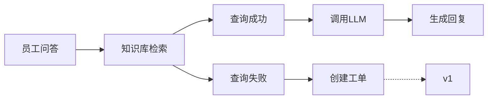

# kb_assistant
## 项目名称
企业制度/知识一体化的助理

## 项目描述
### 🅰️ 整体描述
为了解决员工查找资料困难的问题，提高工作的效率，我们开发了一个 [企业制度/知识一体化的助理] 的项目
本项目基于 LangGraph、RAG、Chroma 等技术构建

其目标是：
    让企业员工可以通过问答的形式来查询企业的知识库（例如公司的产品文档），还可以查询请假/报销等一系列流程，
另外，如果你所问到的问题不在此知识库中，你还可以提交工单供管理员审核。

#### 1. 基础版本
此版本实现了智能问答的核心流程，流程如下：


#### 2. v1 版本
此版本在基础版本的基础上，为了完成系统中的工单，<span style="color: blue">添加了构建/重构知识库的功能</span>，以更好地解决企业知识库中没有相关知识的问题

#### 3. v2 版本（待开发）
此版本会新增功能


### 🅱️ 详细描述
#### 1. 基础版本
员工在前端页面询问问题，后端拿到具体问题之后，使用 RAG 在 chromadb 中检索数据（企业的知识库已提前使用 zhipuai 的 embedding-3 模型嵌入到了 chromadb 中）
- 如果检索到相关数据，则将这些数据作为 【具体问题】 的上下文，之后将其传入到 【提示词（多角色）】 中来调用远程的 LLM（deepseek） 生成相关回复
- 如果没有检索到相关数据，则系统将提示你需要创建工单

#### 2. v1 版本
员工前端提交工单且相关审核人员审核通过后，管理者会在此系统上构建/重建知识库。
- 构建知识库

    管理者会在前端页面中提交上传文件的表单，后端收到表单数据之后调用 fastapi + langchain等，将文件处理为Document对象，随后将其嵌入到 chroma 的某个 collection 中

- 重建知识库

    管理者会在前端页面中点击重建知识库的按钮，后端收到此请求之后，先清空 chroma 中原有的 collection，之后再将默认目录下的知识库处理为 Document 对象，并将其嵌入到 chroma 中


## 项目架构
```text
kb_assistant/
|—— app/                                    源代码
|   |—— ingestion/
|       |—— build_index.py                      构建索引
|       |—— loader.py                       
|   |—— rag/                                知识检索
|       |—— vectorstore.py
|       |—— qa_graph.py                         QA 图
|       |—— prompts.py                          提示词
|   |—— config.py                           配置     
|   |—— deps.py
|   |—— router_graph.py                     顶级路由
|   |—— main.py                             主函数入口
|—— data/                                   数据
|   |——  docs/                                  语料库
|       |—— 公司考勤管理制度.docx
|       |—— 请假审批流程说明.docx
|       |—— 公司薪酬管理制度.pdf
|   |—— tests/                              测试代码
|   |—— ui/                                 前端界面
|       |—— streamlit_app.py
```

## 其他

例如，修改requirements.txt，添加
python-multipart==0.0.20
aiofiles==24.1.0
streamlit==1.40.2

使用如下命令更新
```bash
pip install -U -r requirements.txt
```


